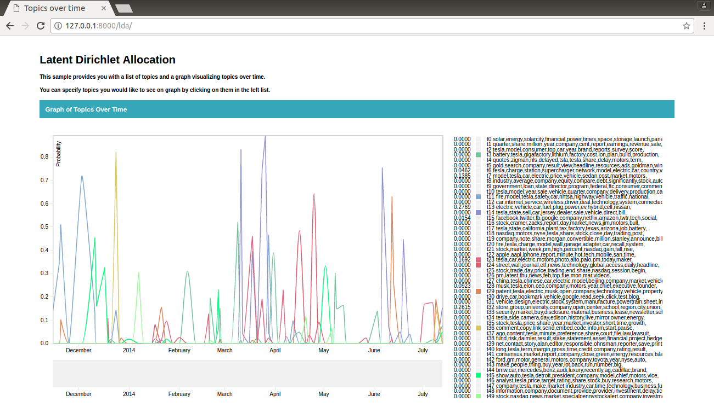
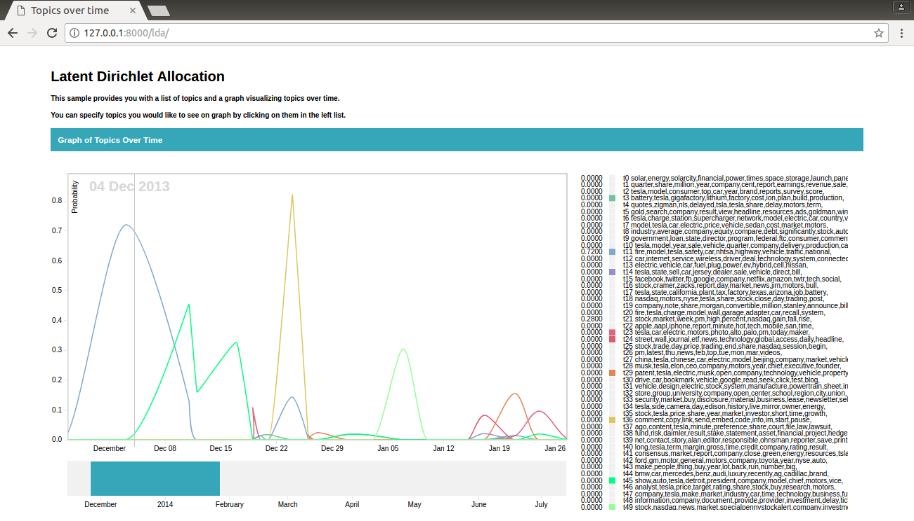

# d3-LDA-over-time

# Table of Contents
1. [Approach](README.md#approach)
2. [Dependencies](README.md#dependencies)
3. [Run Instructions](README.md#run-nstructions)

# Approach

<!--  -->

In order to complete the assigment I used django framework to implement the backend, populate my database using provided tsv files, and pass the data to frontend for visualization. I used a sqlite3 -- a lightweight database for python -- to store my data in. Created the appropriate models for the database and proper functions in views.py to render responses. In the frontend I used d3.js which is a powerful javascript library providing sophisticated data visualizations.

Some issues faced while working with this dataset as it was not clean and extremely unbalanced with lots of 0 probability. In order to make the graphs more readable a pane is provided under the graph to choose a more specific time interval to see more accurate graph results. 

I also took a summerization of the data for preview in order to make it more understandable. On hover you can see a line following the cursur representing the time which is also written in fade mode in background of the graph. As the mouse moves the amounts of data also updates near their name at the right side of the graph.

As the page takes all the data at first and then represents the graph it may take a while to query all data and be retreived in frontend so may need to give it a while for the page to load. But this will give us the fast interactivity on representing graph and zooming in time intervals. 

# Dependencies
This project uses only django 1.11.3 on python 2.7. You should be able to run it without trouble if you install requirements.txt

# Run Instructions
Download or clone this repository.

Install requirements (which is only django):

    pip install -r requirements.txt

Create the database and models and sync them:

    python manage.py migrate

Run the server:

    python manage.py runserver

See your graph at LDA url:

    http://localhost:8000/lda/
